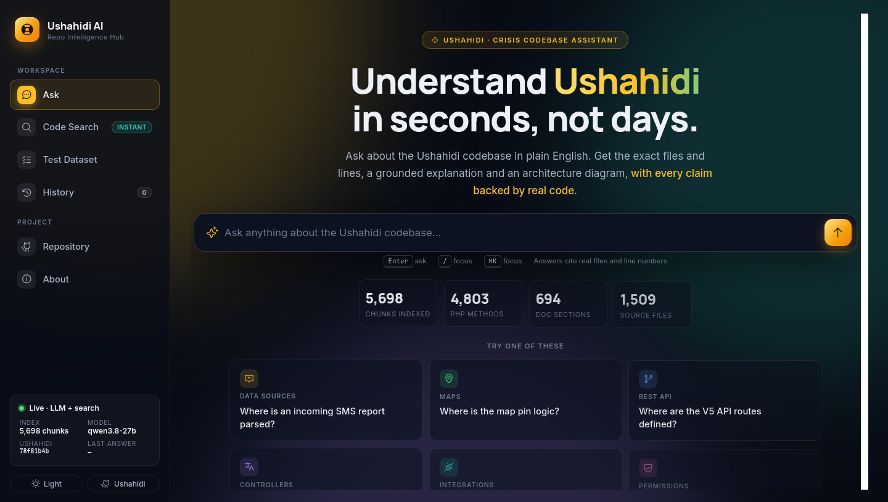

# Disaster Response Intelligence Repo Hub 🚀

An AI onboarding assistant for the [Ushahidi](https://github.com/ushahidi/platform) crisis-mapping platform. A volunteer developer pulled into a crisis can ask *"where is an incoming SMS report parsed?"* and get the exact files and line numbers, a grounded explanation and an architecture diagram in seconds. A fast CI pipeline with an AI safety net protects rushed changes.



## ✨ What it does

| | |
|---|---|
| **Ask** | Plain-English questions → AI Summary, Technical Details, an architecture diagram (Mermaid) and the *actually retrieved* code as evidence, with file + line numbers, syntax highlighting and GitHub links. Every answer shows its timing; a pipeline stepper shows progress. Dark and light theme. |
| **Code Search** | Instant semantic + identifier search over every indexed chunk, no LLM, well under a second. "Explain with AI" hands any hit to the Ask tab. |
| **Never goes dark** | Up to N Groq keys tried in order, then the local Ollama model; with no LLM at all you still get the search results, with a clear warning. |
| **Measured, not claimed** | `evaluate.py` scores retrieval against a 33-question ground-truth dataset (MRR, Hit@k, latency) and saves every run under `reports/eval/`. |
| **Safety net for rushed changes** | GitHub Actions: lint + unit tests in ~1 min, Docker build + integration tests, and on pull requests an AI review of the diff plus auto-generated regression tests. |
| **One-command deploy** | Docker image with the embedding model baked in; `docker compose up` builds the vector DB on first start. `deploy/` has the EC2 / VM script. |

## 🛠 Tech stack

| Layer | Technology |
|---|---|
| Interface | FastAPI web UI (HTML/CSS/JS, Marked + DOMPurify, Mermaid), CLI (`search.py`) |
| Application | `retrieval.py` (hybrid search), `rag_api.py`, `generator.py`, `llm.py` |
| Model | Groq API, `qwen/qwen3.8-27b` by default (`GROQ_MODEL` to change), key chain via `GROQ_API_KEYS`; local fallback `llama3.2:3b` through Ollama |
| Data | ChromaDB (cosine), Sentence Transformers `BAAI/bge-base-en-v1.5`, tree-sitter PHP parser |
| DevOps | GitHub Actions, Docker / Compose, Ruff, Pytest, `tools/ai_review.py`, `tools/generate_tests.py` |

## 🔄 How it works

```text
Ushahidi repo (pinned commit 78f81b4b)
   │  php_extractor.py  - tree-sitter: methods/functions (+ interfaces, traits, enums),
   │                      whole-file chunks for routes/config, line numbers
   │  chunking.py       - split long methods into overlapping windows, markdown docs by heading
   ▼
ingestion.py ──► BGE embeddings ──► ChromaDB (5,698 chunks, rebuilt on every run)

Question ──► retrieval.py
               1. vector search (30 candidates, BGE query instruction)
               2. hybrid score  = similarity + identifier/code/structural/implementation bonuses
               3. LLM rerank of the top 25        (optional, llm.py)        ──► GET /api/search stops here
         ──► generator.py: top 3 chunks → LLM → JSON {simple, technical, diagram}
         ──► UI: answer cards + diagram (backup diagram if the LLM's fails) + evidence
```

## 📂 Project structure

```text
├── rag/
│   ├── app.py               # FastAPI server: /, /api/ask, /api/search, /api/stats, /healthz
│   ├── config.py            # All paths & settings (env-overridable, loads .env)
│   ├── php_extractor.py     # tree-sitter PHP parser
│   ├── chunking.py          # Chunk building, embedding text, metadata
│   ├── ingestion.py         # Builds the ChromaDB vector database
│   ├── retrieval.py         # Shared hybrid search (API, CLI, evaluation)
│   ├── llm.py               # Groq key chain + local Ollama fallback, reranker
│   ├── generator.py         # Answer generation + JSON parsing
│   ├── rag_api.py           # Ask / search / stats for one request
│   ├── search.py            # CLI search
│   ├── evaluate.py          # Retrieval evaluation → reports/eval/
│   ├── check_db.py          # Inspect the vector database
│   ├── eval/questions.json  # Ground-truth dataset (33 questions)
│   ├── tools/
│   │   ├── ai_review.py     # Sweep-style AI review of a diff
│   │   └── generate_tests.py# CodiumAI-style regression-test generator
│   ├── tests/               # Unit + integration tests; tests/generated/ = auto-generated
│   └── frontend/            # Web UI
├── deploy/                  # install_on_ubuntu.sh (EC2 user-data / any VM) + README
├── scripts/smoke_test_compose.sh   # from-scratch `docker compose up` verification
├── reports/                 # health checks, eval runs, ingestion/smoke logs, AI reviews
├── docs/screenshots/        # UI screenshots (before/after)
├── docs/slides/             # team deck (v4 = new UI screenshot)
├── Dockerfile, docker-compose.yml, .github/workflows/ci.yml
```

## 🚀 Getting started (local)

Requires **Python 3.11** (3.10–3.12 work; 3.13+ may lack wheels for some ML packages).

```bash
git clone https://github.com/manyaagarwal23/disaster-response-intelligence-repo-hub.git
cd disaster-response-intelligence-repo-hub
python -m venv .venv && source .venv/bin/activate     # Windows: .venv\Scripts\activate

cd rag
pip install torch==2.14.1 --index-url https://download.pytorch.org/whl/cpu   # CPU-only, much smaller
pip install -r requirements.txt

# 1. Ushahidi at the pinned commit (next to the rag/ folder)
git clone https://github.com/ushahidi/platform.git ../ushahidi
git -C ../ushahidi checkout 78f81b4be6c9aa7cc0a49d6b9d53cf744f45d382

# 2. Build the vector database (~20-40 min on CPU, once)
python ingestion.py

# 3. (Optional) enable LLM answers: put the key in ../.env  (never committed)
echo "GROQ_API_KEY=gsk_..." > ../.env

# 4. Run
python app.py                                   # http://localhost:8000
python search.py "where is an incoming SMS report parsed"   # CLI
```

## 🐳 Docker

```bash
echo "GROQ_API_KEY=gsk_..." > .env    # optional
docker compose up --build             # http://localhost:8000   (PORT=8001 docker compose up for another port)
```

First start fetches Ushahidi at the pinned commit and builds the vector DB into the `rag-data` volume (20–40 min on CPU); later starts are instant. `/healthz` reports `database_ready`. For AWS EC2 or any Ubuntu VM see **[deploy/README.md](deploy/README.md)** (one script, works as EC2 user-data).

## 💻 Viewing the UI from your laptop (VM setups)

The app listens on **port 8080** inside the VM (`PORT=8080` in `.env`). A VM
behind NAT is not reachable from the laptop by itself; use one of these:

- **VS Code Remote-SSH (recommended, nothing to install):** open the
  **PORTS** panel (Terminal area → PORTS, or *View → Open View… → Ports*)
  → **Forward a Port** → `8080`. VS Code remembers it for this remote, and
  `.vscode/settings.json` opens the browser automatically once the port is
  forwarded. Then browse **http://localhost:8080** on the laptop.
- **VirtualBox NAT rule (works without VS Code):** VM → Settings → Network →
  Adapter 1 → Advanced → Port Forwarding → `TCP`, Host Port `8080`, Guest IP
  `10.0.2.15`, Guest Port `8080`. Or on the laptop:
  `VBoxManage controlvm "<VM name>" natpf1 "rag,tcp,,8080,,8080"`.

The container restarts automatically with the VM (`docker start drih-app` if it was stopped).

## 🔌 API

| Endpoint | What it returns |
|---|---|
| `POST /api/ask` `{"question": "..."}` | `answer` (simple, technical, diagram_code, fallback_diagram_code), `sources` (file, lines, class, method, score, content), `llm_used`, `warning`, `timings` (retrieval / rerank / generation / total ms) |
| `GET /api/search?q=...&k=10` | Instant hybrid search results (no LLM) + retrieval timing |
| `GET /api/stats` | Chunk counts by type, pinned Ushahidi commit, models, whether the LLM is configured |
| `GET /healthz` | Liveness + `database_ready` |

## 🧪 Testing & evaluation

```bash
cd rag
pip install -r requirements-dev.txt
ruff check .
pytest                    # unit tests, hand-written + tests/generated/ (seconds, no ML libraries)
pytest -m integration     # end-to-end on a real ChromaDB + embedding model (needs requirements.txt)
python evaluate.py        # retrieval benchmark → reports/eval/<timestamp>.json + latest.md
python evaluate.py --questions 23,25,28 --pause 25   # a subset, paced for Groq's per-minute limits
```

### Retrieval evaluation

For each question in `eval/questions.json` the dataset lists the Ushahidi files that contain the answer. The script reports where the first correct file appears in three rankings: **semantic** (vector only), **hybrid**, and **llm** (hybrid + Groq rerank).

**Latest results** (full run, evening of 2026-10-07, Ushahidi `78f81b4`, 5,698 chunks, Groq `qwen/qwen3.8-27b`, `reports/eval/full-rerank25-run.log`). The morning run with a 10-candidate reranker scored 0.803 / 75.8% / 81.8% / 84.8% on the LLM row:

| Ranking | MRR@10 | Hit@1 | Hit@3 | Hit@5 |
|---|---|---|---|---|
| semantic (vector only) | 0.587 | 48.5% | 63.6% | 72.7% |
| hybrid | 0.610 | 51.5% | 66.7% | 75.8% |
| **hybrid + LLM rerank over 25 candidates** (used by the app) | **0.842** | **78.8%** | **84.8%** | **90.9%** |

Weakest area: permission questions, whose answer files sit at hybrid ranks 14–24 (the vocabulary differs: "permission" vs `PostPolicy` / `PostAuthorizer`). Since 2026-10-07 the LLM reranker therefore sees **25 candidates** (320-char previews) instead of 10. In the full run this lifted four permission questions into the top 10 (three of them to rank 1); only q25 ("Manage Posts permission") still misses, because its answer sits at hybrid rank 17–20 and the reranker is not deterministic across calls. The hybrid row moved from 0.614 to 0.610 between the two runs with identical ranking code: one question flipped between hybrid rank 10 and 11 (approximate nearest-neighbour search at the candidate boundary). Two other ideas were measured and rejected: a BM25 keyword index (`LEXICAL_CANDIDATES`, kept but off by default) and re-weighted identifier bonuses; neither improved the benchmark without hurting another question. Search plus reranking took about 20 s per question in that run (the reasoning model thinks longer over 25 candidates, and the run shared the CPU with an image build); live answers in the app during the day took 2.5–5 s end to end.

Tunables (environment variables, see `rag/config.py`): `RERANK_TOP_K` (25), `RERANK_PREVIEW_CHARS` (320), `LEXICAL_CANDIDATES` (0).

## 🛡 Safety net for rushed changes (CI)

`.github/workflows/ci.yml` runs on every push and pull request:

1. **Lint & unit tests** (~1 min): Ruff (bug-catching rules), pytest including the auto-generated regression tests, and a ground-truth check against the pinned Ushahidi commit.
2. **AI review & generated tests** (pull requests): `tools/ai_review.py` posts a risk review of the diff as a PR comment; `tools/generate_tests.py --changed` writes regression tests for changed modules (kept only if they pass); Ruff auto-fixes are posted as one-click suggestions. Needs the `GROQ_API_KEY` repository secret, otherwise the steps report "skipped". Advisory: it never blocks a merge.
3. **Docker build & integration tests** (only if 1 passes).

A newer push cancels the outdated run, so feedback stays fast under pressure. Both tools also run locally:

```bash
python rag/tools/ai_review.py --base origin/main        # → reports/ai-review-<date>.md
cd rag && python tools/generate_tests.py --all           # → tests/generated/, reports/generated-tests-<date>.md
```

## 🔑 LLM providers: key chain + local fallback

Every LLM request walks a strict chain, configured in `.env` (never committed):

```text
Groq key 1  →  key 2  →  key 3  →  key 4  →  local Ollama model (llama3.2:3b)
```

```bash
GROQ_API_KEYS=gsk_first,gsk_second,gsk_third,gsk_fourth   # tried in this order, per request
OLLAMA_MODEL=llama3.2:3b                                   # end-of-chain fallback (optional)
```

- A key that is **rate-limited** (per minute or per day) hands over to the next one at once. Every request starts again at key 1, so key 1's budget is used first, then key 2's, and so on.
- A key that is **rejected** (401/403) is skipped for the rest of the process.
- When all keys are limited and Groq's "try again in N s" hint is short (≤ 10 s), the keys get one more pass after that wait; only then does the **local model** answer. The UI shows `key N` or `local llama3.2:3b` on every answer.
- The local model writes a **short plain-text summary** only. It never reranks, so the hybrid order is used in that state. It also never writes the diagram; the backup diagram built from the retrieved code is shown instead. The answer carries a note saying it came from the local model.
- On this VM's CPU the local model needs about 30 s to read a 1,200-token prompt and then writes 0.6 to 1.5 tokens per second, so the fallback gets a compact prompt (two code chunks) and a 160-token reply (`OLLAMA_MAX_TOKENS`). Measured end to end: **85 s** for one local answer (`reports/ollama-fallback-2026-10-07.log`); allow up to a few minutes on a busy CPU. It is a last resort, not a replacement for Groq.
- Junk output is rejected (`looks_degenerate` in `generator.py`). The page then shows the search results with a warning instead of nonsense.
- Nothing is downloaded: the fallback uses the model already installed in Ollama (`ollama list`). In Docker the container reaches the host's Ollama through `host.docker.internal` (set in `docker-compose.yml`).

`qwen/qwen3.8-27b` on the Groq free tier allows about **30 requests, 8K input tokens and 1K output tokens per minute, 200K tokens per day** per key. Short pauses are waited out automatically. One full `evaluate.py` run uses most of one key's daily budget, so on a demo day run it early or set `GROQ_MODEL` to another model.

## 📝 Notes for the next phase

- **Done:** instant Code Search (the brief's Sourcegraph role, without an external service), AI review + generated regression tests (the Sweep / CodiumAI roles; Sweep's GitHub bot is discontinued, so `sweep.yaml` is inactive), Docker packaging verified from scratch, deployment script for EC2/VMs, redesigned UI with light theme, deeper LLM reranking for the permission questions, team deck v4 with the new UI.
- **Needs an account / credentials:** running on AWS (`deploy/README.md`), the `GROQ_API_KEY` repository secret for the PR safety net (repo admin only).
- **Still open:** a full 33-question LLM evaluation with the new reranker depth (costs ~100K Groq tokens, half the free daily budget; run it on a quiet day), dependency-graph retrieval for deeper code relationships.
